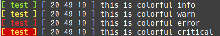
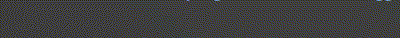

# Logger documentation
Logger can display your log colorfully.

## sample

see sample/sample.cpp

### Logger


```cpp
#include <iostream>
#include <Logger/Logger.hpp>
int main(void){
	Logger console;
	console << "this is colorful info" std::endl;
	console.changeStyle(Logger::StyleSet::WARN);
	console << "this is colorful warn" std::endl;
	console.changeStyle(Logger::StyleSet::ERROR);
	console << "this is colorful error" std::endl;
	console.changeStyle(Logger::StyleSet::CRITICAL);
	console << "this is colorful critical" std::endl;
}
```

### Progress bar


```cpp
#include <iostream>
#include <unistd.h>
#include <Logger/Logger>
int main(void){
	Progress bar(20, title, 2);
	for(int i = 0; i < 10; i++){
			sleep(1);
			bar.show();
	}
}
```


## Installation

	cd Logger
	mkdir build
	cd build
	cmake ../
	make
	sudo make install


## Usage

### Include

```cpp
#include <Logger/Logger.hpp>
```

### CMakeLists.txt

```cmake
cmake_minimum_required(VERSION 3.5)
add_definitions("-std=c++11)
add_executable(your_program your_program.cpp)
target_link_libraries(your_program Logger)
```

